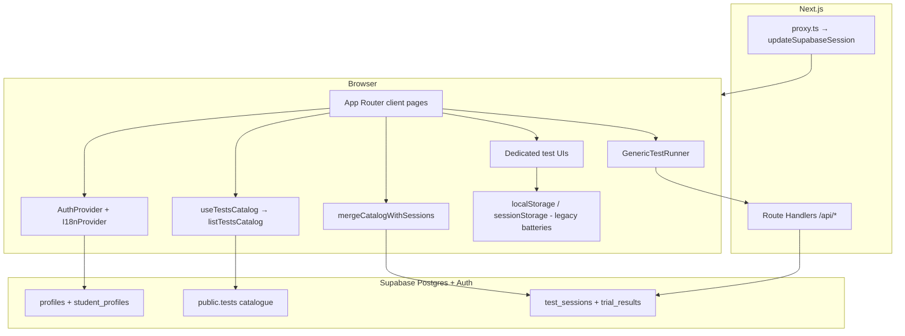

# CogniTest (digital-model) — project overview for agents

**Last reviewed:** 2026-05-05  
**Purpose:** Single reference for **team developers and AI agents**: product intent, **system architecture**, data flow, routing, and production gaps. Update this file when persistence, auth, catalogue, or major routes change.

---

## 1. Product summary

**CogniTest** is a cognitive and mathematical assessment web app (ENS Fès–oriented positioning in UI copy). It combines:

- A **student** journey: domains → capacities → timed assessments, dashboards, results, profile. Progress for many flows is stored in **Supabase** (`test_sessions` / `trial_results`); some legacy batteries still use **browser storage**.
- A **teacher** journey: class overview and per-student views, backed by **Supabase** (roster, visible sessions per RLS) with optional mock scaffolding in admin tooling.
- An **admin / research** area: psychometrics, SEM-style analytics, manual correction, indicators — mix of **Supabase** aggregates and deterministic **mock** cohort data (`lib/admin-mock.ts`) where noted in UI.

The repo is a **Next.js 16 App Router** application with **React 19**, **TypeScript**, **Tailwind CSS 4**, and **shadcn-style** Radix components (`components/ui/`, `cn()` from `lib/utils.ts`).

---

## 2. Technology stack

| Layer | Choice |
|--------|--------|
| Framework | Next.js 16.1 (Turbopack in dev/build) |
| UI | React 19, Tailwind 4, Radix primitives, Recharts, KaTeX (geometry), `next-themes` |
| Auth & DB | Supabase Auth + Postgres (RLS). Clients: `@supabase/ssr`, `@supabase/supabase-js` |
| Forms / validation | `react-hook-form`, `zod`, `@hookform/resolvers` |
| Analytics | `@vercel/analytics` (root layout) |
| PWA hints | `public/manifest.json`, metadata in `app/layout.tsx` |

**Environment variables (typical):**

- `NEXT_PUBLIC_SUPABASE_URL`, `NEXT_PUBLIC_SUPABASE_ANON_KEY` — browser + server user-scoped client.
- `SUPABASE_SERVICE_ROLE_KEY` — **server only** (`getSupabaseAdmin()`); used e.g. for `POST /api/auth/register`.
- Optional: `.env` present when building locally.

**Package metadata:** `package.json` still names the package `my-project` — consider renaming for production clarity.

---

## 3. High-level architecture



### 3.1 Runtime layers

| Layer | Responsibility |
|--------|----------------|
| **Browser** | React 19 UI; `getSupabaseBrowser()` for RLS-scoped reads/writes; `AuthProvider` hydrates session from cookies via `getSession()` / `onAuthStateChange`. |
| **`proxy.ts`** | Runs on matched routes; calls `updateSupabaseSession` so Supabase cookies stay fresh; redirects unauthenticated users away from protected prefixes. |
| **Route Handlers** (`app/api/**`) | Server-side logic with `getSupabaseServer()` (reads cookies, respects RLS as the logged-in user). Use `getSupabaseAdmin()` only where explicitly required and safe. |

### 3.2 Test catalogue (what students “see” as the list of tests)

| Source | File / table | Role |
|--------|----------------|------|
| **Canonical in-repo list** | `mockTests` in `lib/mock-data.ts` | Full student catalogue: ids, optional `questions`, `type`, `duration`, grouping `domain` strings for charts. |
| **Database catalogue** | `public.tests` | Authoritative **names**, **domain slugs**, `metadata` (e.g. `type`, `durationSeconds`, `displayDomain`). RLS: `authenticated` can `SELECT`. |
| **Merge** | `mergeDbCatalogOntoMock()` in `lib/tests-catalog.ts` | After a successful DB fetch, **DB fields overlay** each `mockTests` row by `id`; extra DB-only rows are appended. Keeps embedded questions from code while showing real titles from Postgres. |
| **Hook** | `useTestsCatalog()` in `hooks/use-tests-catalog.ts` | Loads catalogue **only when `user.userId` is set**; falls back to `mockTests` if the query fails or returns no rows. |

**Generic runner metadata:** `getTestForRunner(testId, catalog)` (`lib/tests-catalog.ts`) builds the `Test` object for `GenericTestRunner`: DB title/domain when present, **`questions` still from `mockTests`** when defined there.

### 3.3 Sessions & dashboards (how progress appears)

| Piece | Location | Behaviour |
|--------|-----------|------------|
| **Fetch sessions** | `listMySessions()` in `lib/results/results-service.ts` | `await auth.getUser()` then `select` on `test_sessions`. Ensures JWT is validated before RLS. |
| **Merge with catalogue** | `mergeCatalogWithSessions()` in `lib/student-test-progress.ts` | For each catalogue test, picks a **representative** session per `test_id` (avoids stale `in-progress` masking a later `completed`). Appends **orphan** placeholder tests for any `test_id` in sessions missing from the catalogue so rows never “disappear”. |
| **Score display** | `resolveSessionScorePercent()` | Uses `score` or derives % from `correct_count` / `total_questions`. |
| **UI consumers** | Dashboard, `/tests`, `/results`, `/domains/[id]`, profile, teacher views | Combine `useTestsCatalog().catalog` with `listMySessions` data; several pages re-fetch sessions when `fromDatabase` flips to recover post-login races. |

### 3.4 Two ways completed attempts hit Supabase

| Path | When | Mechanism |
|------|------|------------|
| **Generic MCQ / shared bank** | `GenericTestRunner` submits | `POST /api/submissions` — server scores against `mockTestQuestions` / embedded MCQs, inserts `test_sessions` + `trial_results`. |
| **Dedicated quizzes** (geometry, some batteries) | Client finishes flow | `startSession` / `finishSession` in `lib/results/results-service.ts` — browser client inserts/updates `test_sessions` and inserts `trial_results`. |

**FK rules:** `test_sessions.test_id` → `public.tests(id)`; `test_sessions.user_id` → `public.profiles(id)`. Seed `supabase/seed.sql` so every app `test_id` exists in `public.tests`.

### 3.5 Legacy / hybrid storage

Dedicated batteries (Beery, TVPS, visuo-constructive, many attention/memory helpers) may still write **`sessionStorage` or `localStorage`** via helpers under `lib/*.ts`. The **Results** page surfaces some of those in separate cards; domain tables are **Supabase-first** where sessions exist.

---

## 4. Directory map (agent-oriented)

| Path | Role |
|------|------|
| `app/` | Routes: landing, dashboards, domains, tests, results, teacher, admin, analytics, profile, register |
| `app/api/` | `auth/login`, `auth/logout`, `auth/register`, `submissions`, `student-profile`, `lesson-results` |
| `components/` | Feature UIs (`beery-vmi`, `tvps`, `visuo-constructive`, attentional, memory, geometry, admin, …) + `components/ui/` |
| `lib/` | Domain logic, test IDs, scoring, **`tests-catalog.ts`**, **`results/results-service.ts`**, **`student-test-progress.ts`**, Supabase clients (`supabase/*`), `mock-data.ts`, i18n, psychometrics |
| `hooks/` | `use-toast`, `use-mobile`, **`use-tests-catalog`** (Supabase catalogue + mock merge), etc. |
| `public/` | Static assets, PWA manifest, icons |
| `supabase/` | SQL schema / seeds (if present) — align DB with `lib/types/database.ts` |
| `tools/` | Offline datasets / scripts (not runtime-critical) |
| `.cursor/rules/` | Workspace rules for CogniTest (short-circuit pattern for `/tests/[testId]`) |

---

## 5. Routing reference

| Route | Notes |
|-------|------|
| `/` | Landing + **sign-in** (not a separate `/login` page) |
| `/register` | Registration |
| `/dashboard` | Student dashboard |
| `/domains`, `/domains/[domainId]` | Domain → subdomain → capacity; links to `/tests/[testId]` |
| `/tests`, `/tests/[testId]` | Test list + runner (**critical branching** — see §6) |
| `/results`, `/results/beery-vmi`, `/results/visuo-constructive`, `/results/visuo-perceptive` | Results views |
| `/profile`, `/profile-setup` | Profile |
| `/teacher/dashboard`, `/teacher/students/[studentId]` | Teacher views |
| `/admin/*` | Admin / research / manual correction / SEM / indicators |
| `/analytics` | Student-facing analytics (Recharts + mock institution filter) |

**Proxy:** `PROTECTED_PREFIXES` in `lib/supabase/middleware.ts` includes `/dashboard`, `/profile`, `/profile-setup`, `/tests`, `/results`, `/teacher`, `/admin`, `/analytics`. Unauthenticated users are redirected to `/` with a `redirect` query param.

---

## 6. Tests page contract (`app/tests/[testId]/page.tsx`)

**Rule:** For any new “real” assessment, **early-return** a dedicated component **before** falling through to `GenericTestRunner`.

**Resolved test props:** The generic branch uses `getTestForRunner(testId, catalog)` where `catalog` comes from `useTestsCatalog()` (DB merged onto `mockTests`). Dedicated branches ignore this.

**Dedicated runners (non-exhaustive — verify `page.tsx` imports for the full list):**

- Visuo-motor: `test-visuo-motor` → Beery-style (`lib/beery-vmi.ts` / `components/beery-motrice/`)
- Visuo-constructive: `test-visuo-constructive` → WAIS-style blocks
- Visuo-perceptive hub + TVPS subtests: `lib/visuo-perceptive/*`, `components/visuo-perceptive/*`
- Reasoning: syllogism, Ravens matrices (`lib/syllogism-test.ts`, `lib/ravens-test.ts`)
- Spatial: mental rotation 3D/2D, mental cutting, spatial orientation
- Memory: Corsi (`test-visuo-spatial-memory`), RAVLT, digit span
- Attention: divided / selective / sustained / **trail making** (mapped to `test-visuo-spatial-attention`), shifting, inhibition, processing speed, cognitive flexibility
- Geometry: vectors, symétries, droite au plan, trig circle, espace, produit scalaire (see imports in `page.tsx`)

**Generic path:** Unknown `testId` → `getTestForRunner` may return `undefined` → `GenericTestRunner` with no `test` (still submits with `testId` string); consider 404/redirect for production.

**Registration checklist for a new test id:**

1. `lib/<name>.ts` — `TEST_ID`, types, any storage keys.
2. `components/<name>/` — UI; **early return** in `app/tests/[testId]/page.tsx`.
3. **`mockTests`** (and optional inline `questions`) in `lib/mock-data.ts` — required for merge, generic runner, and **`POST /api/submissions`** scoring.
4. **`public.tests`** row (seed or migration) — required for **FK** on `test_sessions.test_id`.
5. **`lib/platform-domains.ts`** if the capacity appears under `/domains` (student tree).
6. Optional: `app/results/<slug>/page.tsx` for a dedicated results route.

---

## 7. Two “domain navigation” sources

| Source | File | Used by |
|--------|------|---------|
| **`platformDomains`** | `lib/platform-domains.ts` | **`/domains`** and **`/domains/[domainId]`** — seven top-level domains, capacities link to `testId`. |
| **`mainDomains` / `mockTests`** | `lib/mock-data.ts` | Legacy hierarchy + **full test catalogue** for merge/chart grouping (`groupTestsByDomain` uses `Test.domain` strings like `Cognitive Capacity`). |

Charts on `/results` group by **`mockTests`-style domain labels** after merge. **`getDomainPresentation()`** in `lib/domain-ui.tsx` maps known domain strings to colours/icons. Consolidating `mainDomains` vs `platformDomains` remains a product decision.

---

## 8. Data & persistence model

| Mechanism | Used for |
|-----------|----------|
| **Supabase** `profiles` | User id, email, role; joined in `AuthProvider` (`buildAuthSession`). |
| **Supabase** `student_profiles` | Teacher assignment, grade, school; `/api/student-profile`. |
| **Supabase** `public.tests` | Catalogue FK target; titles/domains for UI via `listTestsCatalog` + merge. |
| **Supabase** `test_sessions`, `trial_results` | Generic submissions API, `finishSession`, teacher/admin aggregates. |
| **`lib/mock-data.ts`** | `mockTests`, `mockTestQuestions`, `mainDomains`; **source of truth for question banks** until `public.questions` is wired. |
| **`lib/tests-catalog.ts`** | DB fetch, `mergeDbCatalogOntoMock`, `getTestForRunner`. |
| **`lib/student-test-progress.ts`** | Session ↔ catalogue merge, representative session pick, score resolution. |
| **`sessionStorage` / `localStorage`** | Legacy or hybrid dedicated batteries — inspect `lib/<battery>.ts`. |
| **`lib/server/json-store.ts`** | `data/*.json` on disk — **not** for serverless-only deploys unless replaced. |

**Scoring:** `POST /api/submissions` uses **`mockTests` + `mockTestQuestions`** (and embedded MCQs) on the server. Dedicated flows implement their own scoring and call `finishSession`.

---

## 9. Authentication

- **Client:** `lib/auth-context.tsx` — Supabase `signInWithPassword`, `signUp`, `signOut`; `profiles` lookup for `role` and display name; exposes `AuthSession` (`userId`, `username`, `role`, …).
- **Server registration:** `POST /api/auth/register` may use **admin** client; tighten email confirmation and role policies for production.
- **Types:** `lib/auth-types.ts`; DB schema in `lib/types/database.ts` (regenerate from Supabase when schema changes).

---

## 10. Internationalization

- **`lib/i18n-context.tsx`** — `en` | `fr` | `ar` with a small key set (nav, auth labels). Not full app coverage.

---

## 11. Admin & research features

- Deterministic cohort mock: `lib/admin-mock.ts` + `lib/platform-domains.ts`.
- UI: individual / aggregated / comparison / indicators / SEM / research / manual correction routes under `app/admin/`.
- Supporting libs: `lib/psychometrics.ts`, `lib/sem-model.ts`, `lib/pca.ts`, `lib/recommendations-engine.ts`, etc.

**Production note:** Clearly separate **demo/mock** admin charts from **live** Supabase aggregates to avoid misleading operators.

---

## 12. Feature inventory (checklist)

- [x] Landing + role-based redirect after login (student / teacher / admin)
- [x] Supabase session proxy (`proxy.ts`) + protected routes
- [x] Registration (page + API) and student profile API
- [x] Domain navigation + test catalog
- [x] Large battery of dedicated cognitive / geometry assessments
- [x] Generic MCQ / text / drawing / audio placeholders (generic runner)
- [x] Dedicated results pages for major visuo batteries
- [x] Teacher dashboard (mock student scoping via `getStudentsForTeacher`)
- [x] Admin research dashboard suite (mock + analytics components)
- [x] Student analytics page with recommendations helper
- [x] Dark/light theming (`theme-provider`)
- [x] Mobile nav patterns (`mobile-nav`, sidebar)
- [x] Vercel Analytics hook

---

## 13. Production-readiness — gaps and enhancements

Use this as a backlog; prioritize by deployment target (internal study vs public SaaS).

### Security & compliance

- [ ] **Service role:** Ensure `SUPABASE_SERVICE_ROLE_KEY` never ships to the client; audit all route handlers.
- [ ] **Registration policy:** Disable open `admin` self-signup unless intended; add server-side role allowlist or invite-only flow.
- [ ] **Email confirmation:** Turn on Supabase email confirmation and SMTP for real deployments.
- [ ] **Rate limiting** on `/api/auth/*` and submission endpoints (edge middleware or API gateway).
- [ ] **RLS review:** Confirm policies for `test_sessions`, `trial_results`, `student_profiles`, `profiles` match product rules (teacher sees only assigned students, etc.).

### Reliability & quality

- [ ] **Automated tests:** No Vitest/Jest/Playwright in `package.json` — add CI for critical flows (auth, one dedicated test, submissions API).
- [ ] **Typecheck in CI:** Build log shows **“Skipping validation of types”** — enable `typescript` check in `next build` or run `tsc --noEmit` in CI.
- [ ] **`npm run lint`:** Script runs `eslint .` but **eslint is not listed** in `devDependencies` — fix or remove script; add ESLint 9 flat config aligned with Next.js.
- [ ] **404 for unknown `testId`:** Harden `app/tests/[testId]/page.tsx`.
- [ ] **Console logging:** Remove or gate debug `console.log` in auth and hot paths.

### Operations

- [ ] **Observability:** Structured logging, error reporting (Sentry/OpenTelemetry), RUM beyond Vercel Analytics.
- [ ] **Health checks:** `/api/health` for orchestrators.
- [ ] **Database migrations:** Single source of truth (`supabase/migrations` or hosted migration pipeline); regenerate `lib/types/database.ts` from schema.
- [ ] **Multi lockfile / monorepo root:** Next may infer wrong workspace root if parent `package-lock.json` exists — set `turbopack.root` or isolate repo (build emitted a warning).
- [x] **Proxy convention:** Root `middleware.ts` migrated to **`proxy.ts`** (`export function proxy`) per Next.js 16.

### Product & UX

- [ ] **Unify catalogs:** `mainDomains` vs `platformDomains`.
- [ ] **Consolidate persistence:** Move remaining localStorage/sessionStorage batteries to Supabase sessions for longitudinal analysis.
- [ ] **i18n:** Expand keys or adopt a full i18n library if bilingual rollout is required.
- [ ] **Accessibility:** Audit keyboard traps in fullscreen tests, focus management, ARIA for custom canvases.
- [ ] **Offline / resume:** Define behavior for tab close mid-test.

### Legal / content

- [ ] **Licensing:** Confirm rights for any standardized test content (e.g. TVPS-style, Ravens-style) before public release.
- [ ] **Privacy:** DPIA, consent flows, data retention for student cognitive data.

---

## 14. Commands

```bash
npm run dev    # development server
npm run build  # production build
npm run lint   # verify ESLint is installed and configured
```

---

## 15. How developers / agents should work in this repo

1. **Read architecture first:** **§3–§8** (catalogue merge, sessions merge, dual persistence paths). When in doubt, trace `useTestsCatalog` → `mergeCatalogWithSessions` → `listMySessions`.
2. **Scope:** Touch only files needed for the task; follow existing Card/Button patterns (workspace rule).
3. **New dedicated test:** Follow **§6 checklist** (code + `public.tests` FK + domains).
4. **Do not** expose `SUPABASE_SERVICE_ROLE_KEY` to the client; use `getSupabaseServer()` in Route Handlers for user-scoped DB access.
5. **After structural changes:** Update **this document** (especially §3, §6–§8, §12–§13) so the team keeps a single source of truth.

---

*End of overview.*
